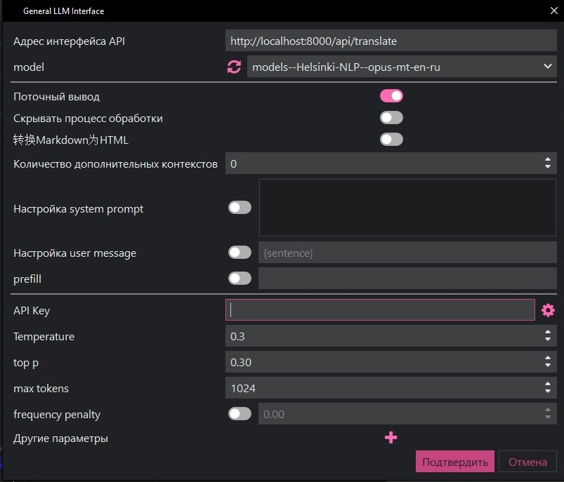

# Neural Network Translator

✨✨✨✔ Важная информация в разработке находится версия на c++ Эта версия была разработана как прототип✔✨✨✨

Офлайн-переводчик с использованием нейросетевых моделей для перевода текста с английского на русский язык.

Почему в коде так много пояснений?

Это сделано для новичков, которые хотят попробовать свои силы в проектах, но не очень хорошо разбираются в коде.

## 🚀 Возможности

- **Пользовательский интерфейс:** Удобный графический интерфейс с поддержкой нескольких тем ✔
- **Офлайн-работа:** Полностью автономная работа без доступа к интернету ✔✔✔
- **API-сервер:** Локальный HTTP-сервер для интеграции с другими приложениями ✔✔✔
- **API-ключи:** Система генерации и управления ключами доступа ✔✔✔
- **Пакетная обработка:** Возможность перевода нескольких текстов одновременно ✔
- **OpenAI-совместимость:** API совместим с форматом OpenAI для простой интеграции ✔✔✔
- **Сохранение настроек:** Автоматическое сохранение состояния между запусками ✔
- **Интеграция с LunaTranslator:** Полная поддержка для офлайн-перевода в играх  ✔✔✔
- **Кэширование переводов:** Быстрый повторный перевод ранее переведенных текстов ✔✔✔
- **Оптимизация для GPU/CPU:** Автоматическое использование доступных аппаратных ресурсов ✔✔
- **Форматирование текста:** Улучшение типографики и соблюдение норм русского языка ✔✔



## 📋 Структура проекта

```
/
├── main.py - Главный файл запуска
├── requirements.txt - Зависимости
├── app_settings.json - Файл настроек приложения
├── models/ - Нейросетевые модели
│   └── models--Helsinki-NLP--opus-mt-en-ru/ - Модель для перевода EN-RU
├── src/ - Исходный код
│   ├── translator/ - Логика перевода
│   ├── ui/ - Компоненты графического интерфейса
│   ├── server/ - Реализация HTTP-сервера
│   └── utils/ - Вспомогательные функции
```

## 💻 Установка

1. Клонировать репозиторий
2. Установить зависимости:

```bash
pip install -r requirements.txt
```

## 🔧 Использование

### Запуск графического интерфейса

```bash
python main.py
```

### Запуск только HTTP-сервера

```bash
python main.py --server-only
```

### Параметры командной строки

| Параметр | Описание | Значение по умолчанию |
|----------|----------|------------------------|
| `--host` | Хост для запуска сервера | 127.0.0.1 |
| `--port` | Порт для запуска сервера | 8000 |
| `--theme` | Тема оформления | dark_blue |
| `--server-only` | Запуск только сервера без GUI | False |

### Доступные темы оформления

- `light` - Светлая тема
- `dark` - Темная тема
- `dark_blue` - Темно-синяя тема
- `plum` - Сливовая тема

## 🔄 Сохранение настроек

Приложение автоматически сохраняет следующие настройки между запусками:

- Последний введенный текст и его перевод
- Конфигурацию сервера (хост и порт)
- API-ключ для доступа к серверу
- Выбранную тему оформления
- Размер и положение окна приложения
- Настройки форматирования текста
- Кэш переводов для быстрого доступа

## 📝 Форматирование текста

Новая функция форматирования текста автоматически улучшает переведенный текст:

- **Умные кавычки:** Преобразование прямых кавычек (") в типографские («»)
- **Правильная пунктуация:** Адаптация пунктуации по правилам русского языка
- **Нормализация пробелов:** Устранение лишних пробелов и правильное форматирование
- **Исправление типичных ошибок:** Автоматическое исправление распространенных ошибок перевода

Вы можете настроить форматирование через API или в пользовательском интерфейсе.

## 🚀 Оптимизация производительности

Приложение теперь работает быстрее благодаря:

- **Кэшированию переводов:** Результаты перевода сохраняются на диск и в оперативную память
- **GPU-ускорению:** Автоматическое использование GPU для ускорения нейросетевых вычислений
- **Оптимизации памяти:** Улучшенное управление ресурсами для стабильной работы
- **Пакетной обработке:** Эффективная трансляция нескольких текстов за один вызов

## 🌐 API-интерфейс

### Стандартные эндпоинты

| Эндпоинт | Метод | Описание |
|----------|-------|----------|
| `/` | GET | Проверка работы API |
| `/api/translate` | POST | Перевод текста |
| `/api/translate_batch` | POST | Пакетный перевод текстов |
| `/api/generate_key` | POST | Генерация нового API-ключа |
| `/api/revoke_key` | DELETE | Отзыв API-ключа |
| `/api/status` | GET | Статус сервера и системные метрики |
| `/api/cache/status` | GET | Статус кэша переводов |
| `/api/cache/control` | POST | Управление кэшем переводов |
| `/api/cache/clear` | POST | Очистка кэша переводов |
| `/api/formatting/options` | GET | Получение настроек форматирования |
| `/api/formatting/options` | POST | Установка настроек форматирования |

### OpenAI-совместимый эндпоинт

| Эндпоинт | Метод | Описание |
|----------|-------|----------|
| `/v1/chat/completions` | POST | Совместим с OpenAI Chat API |

### Пример использования с библиотекой OpenAI

```python
from openai import OpenAI

client = OpenAI(
    api_key="ваш_api_ключ",
    base_url="http://localhost:8000"
)

response = client.chat.completions.create(
    model="any-model-name",  # название модели может быть любым
    messages=[
        {"role": "user", "content": "Translate this text to Russian"}
    ]
)

print(response.choices[0].message.content)
```

### Формат API-ключей

- **Основной формат:** `nn_translator_*`
- **Поддерживаемые для совместимости:** `nn_tr_*` и `sk-*`

## 🎮 Интеграция с LunaTranslator

[LunaTranslator](https://github.com/HIllya51/LunaTranslator) - популярное приложение для перевода игр и программ. Наш переводчик можно использовать как полностью офлайн-решение для перевода в играх.

### Пошаговая настройка в LunaTranslator

1. **Запустите Neural Network Translator в режиме сервера:**
   ```bash
   python main.py --server-only --host 127.0.0.1 --port 8000
   ```

2. **Сгенерируйте API-ключ** во вкладке "API Server" приложения

3. **Настройте LunaTranslator:**
   - Откройте настройки LunaTranslator
   - Перейдите в раздел "Перевод" → "Внешние API"
   - Добавьте новый сервис:
     - **Тип:** OpenAI API (или Custom API)
     - **URL:** `http://localhost:8000/v1/chat/completions`
     - **API-ключ:** _ваш сгенерированный ключ_
     - **Промпт:** `Translate the following text from English to Russian: "{text}"`

4. **Активируйте переводчик** в основных настройках LunaTranslator

### Использование стандартного API

Альтернативно, можно использовать стандартный API:
- **Endpoint:** `http://localhost:8000/api/translate`
- **Метод:** POST
- **Заголовки:** 
  ```
  api-key: ваш_ключ
  Content-Type: application/json
  ```
- **Тело запроса:** `{"text": "текст_для_перевода"}`

### Преимущества использования с LunaTranslator
- Полностью офлайн-работа без доступа к интернету
- Высокая скорость перевода
- Отсутствие ограничений на количество запросов
- Конфиденциальность (данные не отправляются на внешние серверы)
- Кэширование переводов для повторяющихся фраз
- Улучшенное форматирование текста для большей читаемости

## ⚙️ Системные требования

- **Python:** 3.8 или выше
- **Библиотеки:** PyTorch, Transformers, FastAPI, Tkinter
- **Дисковое пространство:** ~1 ГБ (в основном для модели перевода)
- **ОЗУ:** Минимум 4 ГБ, рекомендуется 8 ГБ
- **GPU:** Опционально, но значительно ускоряет перевод 

## 📜 Лицензия

Этот проект распространяется под лицензией [GNU General Public License v3.0](LICENSE).

Данная лицензия гарантирует пользователям право:
- Использовать программу в любых целях
- Изучать и модифицировать исходный код
- Делиться программой и её модификациями

При этом все производные работы также должны распространяться под лицензией GPL v3, что обеспечивает сохранение свободы программного обеспечения.

Полный текст лицензии доступен в файле [LICENSE](LICENSE) и на [официальном сайте GNU](https://www.gnu.org/licenses/gpl-3.0.html). 
